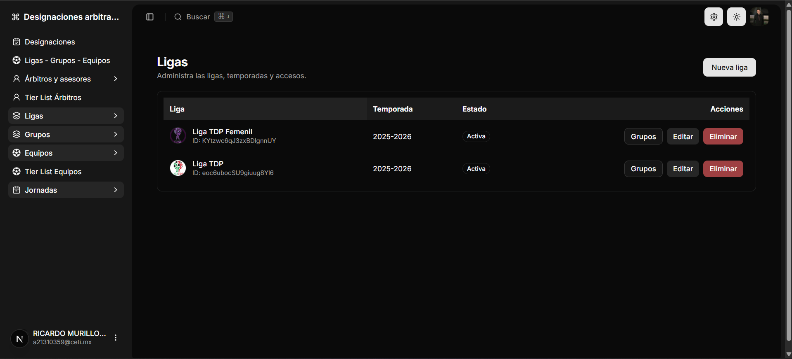
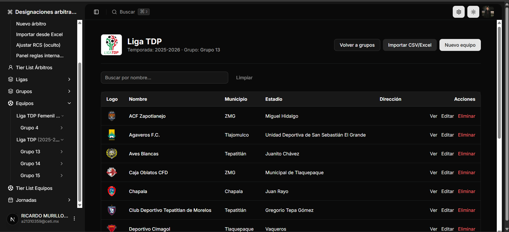
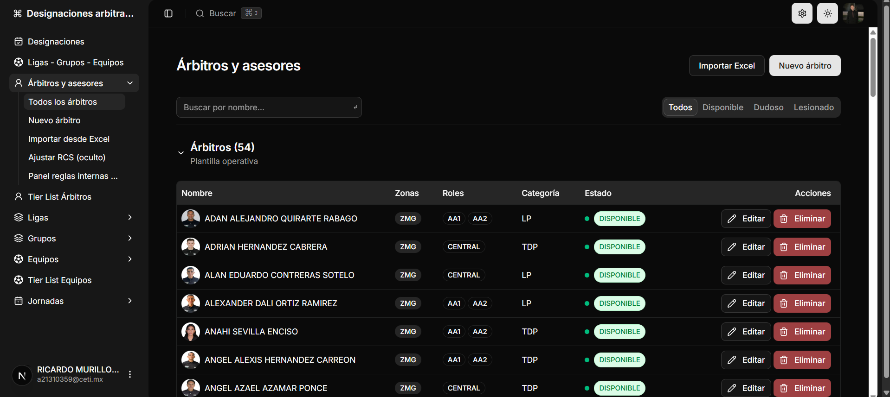
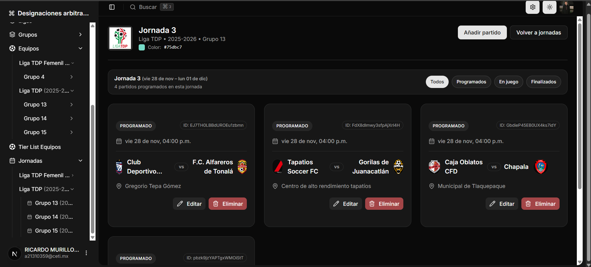
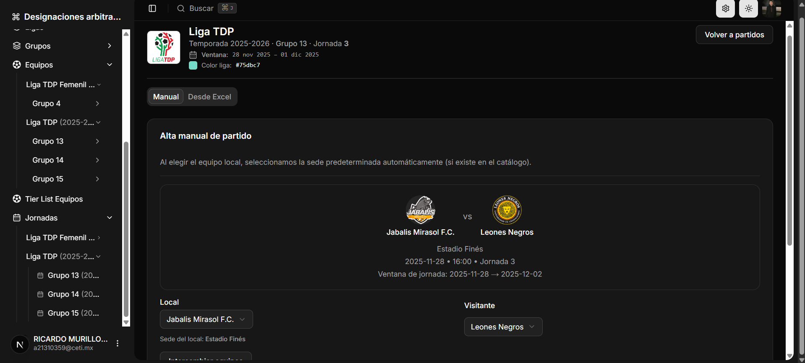
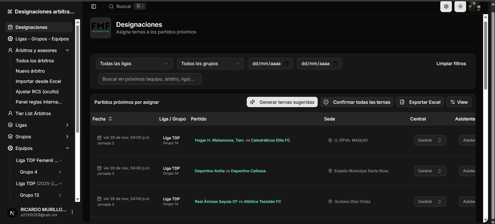

# 🧩 Assigner TDP — Automated Referee Assignment System

<p align="center">
  
  
  
  
  
</p>

<p align="center">
  <strong>Automated, rule-driven referee assignment engine for Liga TDP</strong><br/>
  Built with Next.js 16, Firebase Admin, Shadcn UI, and a modular colocation architecture.
</p>

---

# 📚 Table of Contents
- [Overview](#overview)
- [Core Features](#core-features)
- [Assignment Engine](#assignment-engine)
- [Tech Stack](#tech-stack)
- [Architecture](#architecture)
- [Screenshots](#screenshots)
- [Getting Started](#getting-started)
- [Security](#security)
- [Roadmap](#roadmap)
- [About](#about)

---

# 📝 Overview

**Assigner TDP** is a centralized system used to automate the assignment of referee crews (terna arbitral) for **Liga TDP**.

It replaces spreadsheets and manual workflows with:
- Conflict detection  
- Rule enforcement  
- Difficulty balancing (MDS)  
- Real-time Firestore synchronization  
- A powerful admin dashboard for coordinators and superusers  

This system is actively developed and maintained by **SAURIC S.A. de C.V.**

---

# ⭐ Core Features

## 🟦 Automated Referee Assignment
- Suggests full crews: **Central, Assistant 1, Assistant 2**
- Applies league rules, seniority constraints, and RA-XX overrides
- Calculates MDS (Match Difficulty Score)
- Splits candidates by role and filters based on availability, history, and rules

## 🟥 Conflict Detection
- Team repetition  
- Pair conflicts between assistants  
- Excessive frequency with same club  
- Forbidden combinations  
- Missing availability  
- Seniority and tier mismatches  

## 🟨 Admin Dashboard
- League → Group → Matchday → Match navigation  
- CRUD for Referees, Teams, Matchdays, Matches  
- Manual override tools for coordinators  
- Table filtering, sorting, and pagination  
- Dark/light mode themes  
- Collapsible sidebar  

---
# 🔧 Assignment Engine

Below is the simplified flowchart of the assignment engine:

```mermaid
flowchart TD
    A[Load Match] --> B[Load Candidate Pool]
    B --> C[Filter by Availability]
    C --> D[Split by Role: Central / A1 / A2]
    D --> E[Apply Internal Rules RA-XX]
    E --> F[Compute MDS Score]
    F --> G[Sort Candidates by Priority]
    
    G --> H[Pick Central]
    H --> I[Pick Assistant 1]
    I --> J[Pick Assistant 2 (avoid pair conflicts)]
    
    J --> K{Valid Crew?}
    K -- Yes --> L[Return Suggested Terna]
    K -- No --> M[Fallback Logic / Manual Review]

# 🧰 Tech Stack

## **Frontend**
- Next.js 16 · TypeScript
- Shadcn UI
- Tailwind CSS v4

## **Backend**
- Firebase Admin SDK
- Firestore
- Next.js Server Actions
- Zod validation

## **State & Forms**
- Zustand
- React Hook Form

## **Tables**
- TanStack Table v8

## **Tooling**
- ESLint · Prettier · Husky
- GitHub Actions

---

# 🖼 Screenshots

## 📌 Leagues


## 📌 Teams


## 📌 Referees List


## 📌 Matches


## 📌 Create Match


## 📌 Assignments View


---

# 🚀 Getting Started

### **1. Clone the repository**
git clone https://github.com/rickyma18/assigner-tdp.git

2. Install dependencies
npm install

3. Configure Firebase Admin

Set your environment variables:

GOOGLE_CLOUD_CREDENTIALS_JSON="{}"
NEXT_PUBLIC_FIREBASE_CONFIG="{}"

4. Start dev server
npm run dev


Your app will run at: http://localhost:3000

🔐 Security

All assignment logic runs on secure server actions

No assignment operations are exposed on the client

Firestore rules enforce role-based access

Only coordinators and superusers can generate ternas

All writes are audited

🛣 Roadmap
Coming soon:

Assignment history & reports

Difficulty heatmaps (MDS visualization)

Referee performance scoring

Multi-league / multi-tenant support

CSV import/export

Official mobile companion app

Full RBAC control panel

⚽ About

Assigner TDP is developed by SAURIC S.A. de C.V., creators of referee and league-administration systems for Mexican football.
The platform is designed to increase fairness, transparency, and efficiency in referee assignments across Liga TDP.

<p align="center"> Built with ❤️ by <strong>Ricardo Murillo</strong> </p> ```
